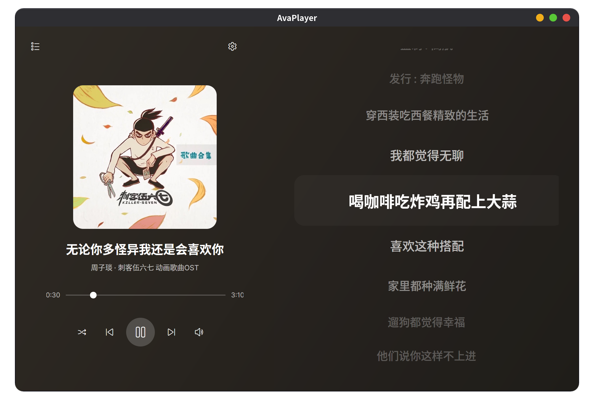
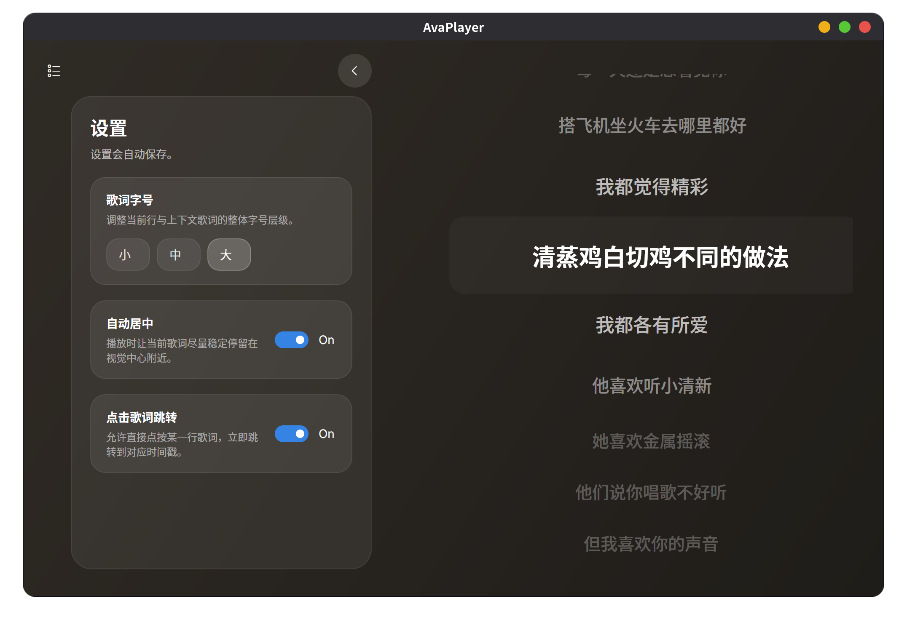

# AvaPlayer

一个基于 **.NET 10 + Avalonia 12** 的本地桌面音乐播放器，目标是提供：

- 本地优先、尽量少联网的音乐播放体验
- `libmpv` 驱动的高兼容音频播放
- SQLite 本地数据存储
- 歌词、封面、播放列表、系统托盘、会话恢复
- Linux MPRIS / Windows 系统媒体控制联动

## 界面预览

| 主播放界面 | 播放列表抽屉 | 设置界面 |
| --- | --- | --- |
|  |  |  |

## 功能特性

- **本地曲库**
  - 扫描文件夹导入音频文件
  - 使用 TagLibSharp 读取标题、歌手、专辑、时长
  - SQLite 持久化曲库与会话状态

- **播放控制**
  - 上一首 / 播放暂停 / 下一首
  - 顺序播放、列表循环、单曲循环、随机播放
  - 进度拖动、音量调节
  - 关闭窗口保留托盘，支持轻量模式

- **歌词体验**
  - 优先本地 `.lrc`
  - 在线歌词多源回退
  - 当前歌词高亮、自动居中、点击歌词跳转
  - 歌词字号、自动居中、点击跳转开关可持久化

- **桌面集成**
  - 系统托盘菜单（上一首 / 播放暂停 / 下一首 / 轻量模式）
  - Linux 下支持 **MPRIS**
  - Windows 下支持 **SMTC**（系统媒体传输控件）

- **会话恢复**
  - 记录上次曲目、播放位置、播放模式
  - 启动时自动恢复到上次曲目和位置
  - 恢复后默认保持暂停状态

## 技术栈

| 类别 | 技术 |
| --- | --- |
| UI | Avalonia 12、Fluent Theme、FluentIcons.Avalonia |
| 运行时 | .NET 10 |
| 架构 | MVVM、依赖注入（`Microsoft.Extensions.DependencyInjection`） |
| ViewModel | CommunityToolkit.Mvvm |
| 音频后端 | `libmpv` |
| 本地数据库 | SQLite（`Microsoft.Data.Sqlite`） |
| 元数据读取 | TagLibSharp |
| 网络能力 | `HttpClientFactory` |
| Linux 媒体控制 | Tmds.DBus.Protocol（MPRIS） |

> 项目**不使用 EF Core**，SQLite 访问基于直接 SQL，便于保持 AOT 友好。

## 项目结构

```text
App.axaml / App.axaml.cs          应用生命周期、托盘、轻量模式
Program.cs                        Avalonia 启动入口
Views/                            Avalonia 视图
ViewModels/                       MVVM 视图模型
Services/Audio/                   libmpv 加载与播放器控制
Services/Playlist/                曲库扫描、播放队列
Services/Lyrics/                  歌词抓取、缓存与质量筛选
Services/AlbumArt/                封面读取与缓存
Services/Database/                SQLite 持久化
Resources/Styles.axaml            公共样式与动画
runtimes/                         可选的按 RID 放置的 libmpv 原生库
assets/                           README 截图素材
```

## 环境要求

- **.NET 10 SDK**
- 对应平台可用的 **libmpv 原生库**

## 获取 libmpv

应用启动时会按以下顺序查找 `libmpv`：

1. 程序输出目录根目录
2. `runtimes/<RID>/native/`
3. 系统动态库搜索路径

当前代码内置的文件名约定如下：

| 平台 | 期望文件名 |
| --- | --- |
| Windows x64 | `libmpv-2.dll` |
| Linux x64 | `libmpv.so.2` 或 `libmpv.so` |
| macOS x64 | `libmpv.2.dylib` 或 `libmpv.dylib` |
| macOS arm64 | `libmpv.2.dylib` 或 `libmpv.dylib` |

### 方式一：随项目一起分发（推荐）

把对应平台的原生库放到下面的目录中：

```text
runtimes/
  win-x64/native/libmpv-2.dll
  linux-x64/native/libmpv.so.2
  osx-x64/native/libmpv.2.dylib
  osx-arm64/native/libmpv.2.dylib
```

这样在 `dotnet build` / `dotnet publish` 时，项目会只复制**当前 RID** 对应的 `runtimes/<RID>` 子目录，不会把所有平台的库一起打包。

### 方式二：使用系统安装的 libmpv

也可以直接使用系统已安装的 `libmpv`：

- **Windows**：从 mpv/libmpv 对应发行包中获取 `libmpv-2.dll`
- **Linux**：安装提供 `libmpv.so.2` 的发行版包
- **macOS**：通过 Homebrew 或其他方式安装可提供 `libmpv.dylib` 的 mpv/libmpv

如果系统库已在动态库搜索路径中，项目可以直接加载，无需放进 `runtimes/`。

## 本地开发

### 1. 还原依赖

```bash
dotnet restore
```

### 2. 编译

```bash
dotnet build
```

### 3. 运行

```bash
dotnet run
```

> 首次运行前请先确认 `libmpv` 已就绪，否则播放器会提示 `libmpv 不可用，无法播放`。

## 发布

Release 配置默认启用了 **Native AOT**：

- `PublishAot=true`
- `BuiltInComInteropSupport=false`

### Linux x64

```bash
dotnet publish -c Release -r linux-x64 --self-contained true
```

### Windows x64

如果在 Windows 主机上发布：

```bash
dotnet publish -c Release -r win-x64 --self-contained true
```

如果在非 Windows 主机上交叉发布 Windows：

```bash
dotnet restore -r win-x64 -p:EnableWindowsTargeting=true -p:TargetFramework=net10.0-windows
dotnet publish -c Release -r win-x64 --self-contained true -p:EnableWindowsTargeting=true -p:TargetFramework=net10.0-windows
```

发布输出通常位于：

```text
bin/Release/<TargetFramework>/<RID>/publish/
```

## 打包脚本

仓库内置了两套打包脚本，优先覆盖你现在最需要的格式：

- `scripts/package-linux.sh`
  - 生成 `tar.gz`
  - 如果系统安装了 `zip`，额外生成 `zip`
  - 如果提供了 `appimagetool`，额外生成 `AppImage`

- `scripts/package-windows.ps1`
  - 生成 `zip`
  - 如果安装了 **Inno Setup**，额外生成安装器 `exe`
  - 如果安装了 **WiX CLI**，额外生成 `msi`

### Linux

```bash
scripts/package-linux.sh
```

如果你希望额外生成 `AppImage`，先准备 `appimagetool`：

```bash
mkdir -p tools
curl -L https://github.com/AppImage/appimagetool/releases/latest/download/appimagetool-x86_64.AppImage -o tools/appimagetool-x86_64.AppImage
chmod +x tools/appimagetool-x86_64.AppImage
APPIMAGE_TOOL_PATH="$PWD/tools/appimagetool-x86_64.AppImage" scripts/package-linux.sh
```

### Windows

在 Windows PowerShell 中执行：

```powershell
.\scripts\package-windows.ps1
```

可选外部组件：

- **Inno Setup**
  - 下载地址：<https://jrsoftware.org/isinfo.php>
  - 用于生成安装器 `exe`

- **WiX CLI**
  - 安装命令：`dotnet tool install --global wix`
  - 用于生成 `msi`

打包产物统一输出到：

```text
artifacts/package/<RID>/<Version>/
```

## 数据与缓存目录

应用会把数据写到系统本地数据目录下的 `AvaPlayer`：

- **SQLite 数据库**
  - Linux: `~/.local/share/AvaPlayer/avaplayer.db`
  - Windows: `%LOCALAPPDATA%\AvaPlayer\avaplayer.db`

- **缓存目录**
  - Linux: `~/.local/share/AvaPlayer/cache/`
  - Windows: `%LOCALAPPDATA%\AvaPlayer\cache\`

缓存主要用于：

- 歌词缓存
- 封面缓存

## 歌词来源说明

项目目前采用本地优先、多源回退的方式：

1. 同目录 `.lrc`
2. 在线歌词源回退
3. 本地缓存复用

在线歌词能力用于补全体验，但整体设计仍然以**本地音乐库播放器**为核心，而不是流媒体客户端。

## 开发说明

- 主题：Avalonia Fluent Theme
- 数据绑定：默认启用 Compiled Bindings
- 架构：以服务层 + ViewModel 为中心，不在 UI 中写业务逻辑
- 数据库：SQLite + 手写 SQL
- 音频解码/播放：通过 `libmpv` 间接使用底层音频能力，不直接操作编解码细节
